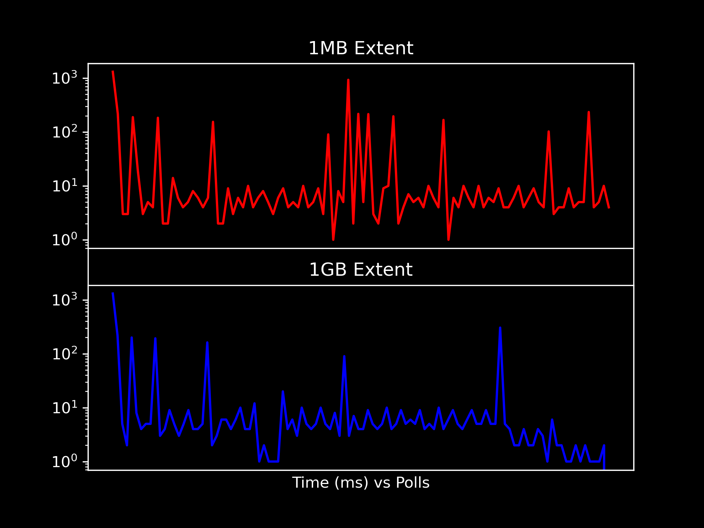

# Kafka + NetApp <sup>^AI</sup>
Building a Connector Better than Market

🎙️ [Guang Zhao](https://zheguang.github.io)

©️ 2025 NetApp, Inc. All rights reserved.

---

## Data

🍺 NetApp Ontap/StorageGrid

🐿️ Kafka pipeline

--

## Interface

🍺 <ins>S</ins>imple (object) <ins>s</ins>torage <ins>s</ins>ervice (S3)

🐿️ Kafka Connect

🦀 Aiven/Confluent/... Connectors

--

## End of story?
Everything seems standard...

---

## Problem

✅ Parquet, CSV, JSON

❓ 1GB ~ 1TB per object

--

## Limitation Left & Right

--

### Ontap/StorageGrid 

Unstable single read >10GB object

--

### Market

--------------------------------------------------------
| Confluent        | Aiven                  | Lenses   |
| ---------        | ------                 | ------   |
| <2GB<sup>a</sup> | <min(Instance,10GB)<sup>a,c,d</sup>  | <10GB<sup>d</sup>    |
| Closed           | -                      | -        |
| -                | Utf-8 only<sup>b</sup> | -        |
| -                | Inefficient conversion | -        |
--------------------------------------------------------
* a. Parquet
* b. Text
- c. "Download approach"
- d. "Single stream approach"

---

## Problem is scale

- Simple I/O abstraction for all formats and patterns
- Scalable I/O implementation for object storage

---

## Let's Solve it

---

## Background

--

### Text: Sequential Access

```csv
1,first,row
2,second,row
...
N,nth,row
```
```json
{ object: 1 }
{ object: 2 }
...
{ object: N }
```
Scan the file from the first to the last line.

--

### Parquet: Semi Random Access

```text
+----------------+       
| Chunk 1, Col 1 <-------+-------+
| Chunk 1, Col 2 |       | Row 1 |
| C...           |       | Row 2 |
| Chunk 1, Col N |       | ...   |
+----------------+       | Row M |
| Chunk 2, Col 1 |       +-------+
| C...           |
| Chunk 2, Col N |
+----------------+
...
| Chunk N        |
+----------------+
| File Metadata  |
+ ---------------+
```
1. jump to the end to read Metadata
2. jump back to chunk, read row in multiple offsets
* Col_1[i], Col_2[i], ..., Col_N[i]


--

### Kafka Connect

- Poll external records by batches
- Convert types
- Publishes records to Kafka topic

External system as what?

--

### \#0: All are ... Byte Streams

```java
abstract class java.io.InputStream {
    ...
    // Only forward
    long skip(long n) throws IOException;

    // Let's not get into mark() and reset()...
}
```

Can't support Parquet

Can't handle large S3 object


---

## Break the Abstraction

--

### \#1: With Random Access
```java
class RandomAccessInputStream extends FilterInputStream {
    ...
    // Forward and backward
    void seek(long offset) throws IOException;
}
```

~~Can't support Parquet~~

Can't handle large S3 object

--

### \#2: Broken into Extents

```java
class ExtentInputStream extends RandomAccessInputStream {
    long extentSize;
    long extentOffset;
    ...
}
```
Extent: (offset, size)

--

#### Diagram

```text
     +------------------+-----------------+-----+
     | Parquet Decoder  | Unicode Decoder | ... |
     +------------------+-----------------+-----+
                        |
                        |
+-----------------------+--------------------------------+
| byte[0], byte[1], ...                        byte[N]   |
+================+================+=====+================+
| ext[0]         | ext[1]         | ... | ext[M]         |
+----------------+----------------+-----+----------------+
| S3.GetRange[0] | S3.GetRange[1] | ... | S3.GetRange[M] |
+----------------+----------------+-----+----------------+
```

* $$ byte[i] = ext[i / size][i \mod size ] $$
* `seek(i)` tell S3 don't bother with skipped bytes
* Optimal `extentSize` ❓

---

### Power of Abstraction

```text
                +--------------+
                |  Connector   |
                +-------+------+
                        |
     +------------------+-----------------+-----+
     | Parquet Decoder  | Unicode Decoder | ... |
     +------------------+-----------------+-----+
                        |
+-----------------------+--------------------------------+
| byte[0], byte[1], ...                        byte[N]   |
+================+================+=====+================+
| ext[0]         | ext[1]         | ... | ext[M]         |
+----------------+------+---------+-----+----------------+
                        |
        +---------------+-------------+--------+
        | Object Store  | File System | ...    |
        +---+-----------+-------------+--------+
            |
        +---+------+
        |  S3      |
        +----------+-------------+--------+-----+
        | 🍺 Ontap | StorageGrid | 😄 Aws | ... |
        +----------+-------------+--------+-----+
                  /
+----------------+----------------+----------------------+
| S3.GetRange[0] | S3.GetRange[1] | ... | S3.GetRange[M] |
+----------------+----------------+----------------------+
```
* Extents 🔄 external systems
* Bytes 🔄 data formats


--

### Extensible

```text
        Data Formats
            ^
            |
    Parquet |
            |
    Text    |
            |   🍺 Ontap  StorageGrid  😄 Aws
            +----------------------------------> Systems
    Extent-Stream
```


---

## (Auto-)Tune Our Connector

--

### External I/O characteristics

* External systems
* Workload
- Data formats
- Size

❓ Find the best Connecor performance

--

### Unknowns
- External system designs & changes
- Documentation inaccuracies
- Human intuition unreliable

--

### Machine Learning Problem

$$ \arg\max_{param} P(connector \| param, sys, work) $$

- <ins>param</ins>eters: extent size
- P, model: throughput
- <ins>Sys</ins>tem: S3, Ontap, StorageGrid, Local
- Representative <ins>work</ins>load?

---

## 🤖 AI Attempt \#1

--

### Code-only AI

👦: Hey 🤖, given my code, what's the optimal parameter?

$$ \arg\max_{params} P(connector \| param) $$

--

### AI correct?
🤖:
"Disk block sizes commonly are 512B or 4KB. Set 1KB."

🤖:
"S3 recommends PutObject limit 5GB, max 5TB, Set 5GB."

---

## Benchmark

--

### TPC-H Dataset
-------------------------------------------------------
|         | Parquet Small | Parquet Large | CSV Small |
| --      | --------      | -------       | --------- |
|Table    | Customer      | Lineitem      | Customer  |
|Scale    | 10            | 30            | 10        |
|Rows     | 1.5M          | 37.23B        | 1.5M      |
|Compress | 1:2           | 1:2           | 1:1       |
|Size(B)  | 118M          | 6.3G<sup>a,b</sup>          | 237M      |
-------------------------------------------------------------------

- a. Beyond Confluent limit
- b. Aiven min instance disk space

--

### Workload
```python
num_polls = 10
batch_size = 128
for i in range(num_polls):
    poll(batch_size)
```

--

### 🍺 StorageGrid time (ms)
------------
| Extent(B) | Csv Small | Parquet Small | Parquet Large   |
| ------    | -------:  | ------------: | ------------:   |
| 1K        | 480,501   | >1min         | >1min           |
| 4K        | 470,438   | >1min         | >1min           |
| 1M        | 4,695     | 17,134        | 12,292          |
| 4M        | 2,967     | 8,630         | 9,304           |
| 1G        | 2,937     | 6,782         | 6,377           |
| 4G        | 2,669     | 6,242         | 6,196           |
------------
* std ~ 5% mean

--

### 🍺 StorageGrid vs 😃 AWS

------------------
| Extent(B) | StorageGrid<sup>a</sup> | Aws<sup>a</sup>     |
| --------- | ----------: | --:     |
| 1K        | 480,501     | 573,496 |
| 1M        | 4,695       | 4,813   |
| 1G        | 2,937       | 2,895   |
------------------
* a. CSV Small
- std ~ 5% mean


---

### Takeaway

* Scales better than Confluent
* StorageGrid vs Aws comparable
* Optimal extent size 
    - depends on data format
    - requires internal knowledge
    - is not what naive AI suggests

---

## 🤖 AI Attempt \#2

--

### Stochastic gradient descent

```python
num_polls = 10
batch_size = 128
x = extent_size
for i in range(num_polls):
    time = model(poll(batch_size), x)
    grad = gradient(model, time, x)
    x = step(grad, x)
```
Convergence: found an extent size with fastest poll

--

### Problems

Model is discrete, non-differentiable.

It assumes each poll time is stable given extent.

But there is no bound.

--



--

### 🤷 No guarantee 
Based on local info, cannot converge to optimal extent

---

## 🤖 AI Attempt \#3

Go above abstraction

Combine LLM (\#0) and ML (\#1)

--

### Agent for Benchmark + Tune

```python
while True:
    extent_sizes = Llm.generate_response(
        'Guess optimal extent size', 
        context)

    times = []
    for x in extent_sizes:
        times += repeat(
            10, 
            model(poll(batch_size), x))

    better_extent_size = find_min(times, extent_sizes)

    context.add(better_extent_size)
```

--

### Result

Experimental... ⌛

---

## Features

* Unlimited size
* Extensible formats
* Extensible endpoints
* (Autotune agent ⌛)

- Unicode
- Aync object discovery
- Nested prefixes
- 1-1 Type conversion

👍 Better than Market {🦀,...}

--

## Heads up

- 👁️ Cassandra Parquet/Avro Transformer by [Stefan](stefan.miklosovic@netapp.com)

- Operational to analytical:

👁️ Cassandra - 🐿️ Kafka - X?

---

## Thanks

* Anup: Testing
* Amanda: Organizing
* Carlos: Organizing
* Justin: Organizing

- Liam: Discussion
- Nilkua: NetApp configs
- Varun: Organizing
- Win: Ontap Details

* Team Kafka: Review PR
* Team Open Source: Discussion
* Team PoC: Customer & Product

🤷 All technical errors are mine.

---

## Thoughts?

💻 https://github.com/instaclustr/kafka-connect-connectors

▶ Contribution welcome!

📧 Guang.Zhao@netapp.com

Slack #opensauce

🏢 Melbourne
